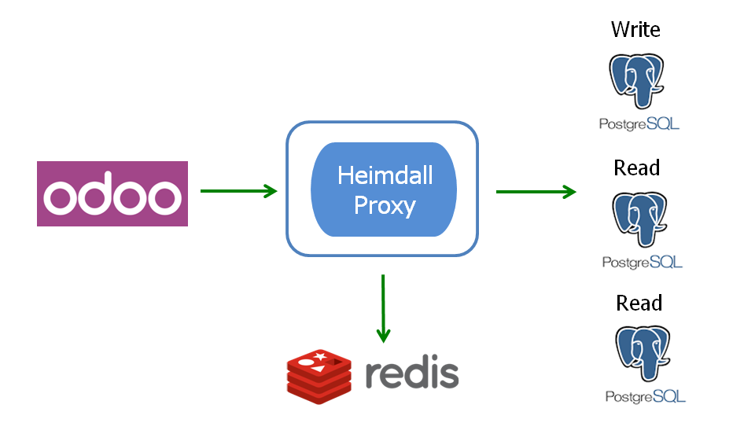
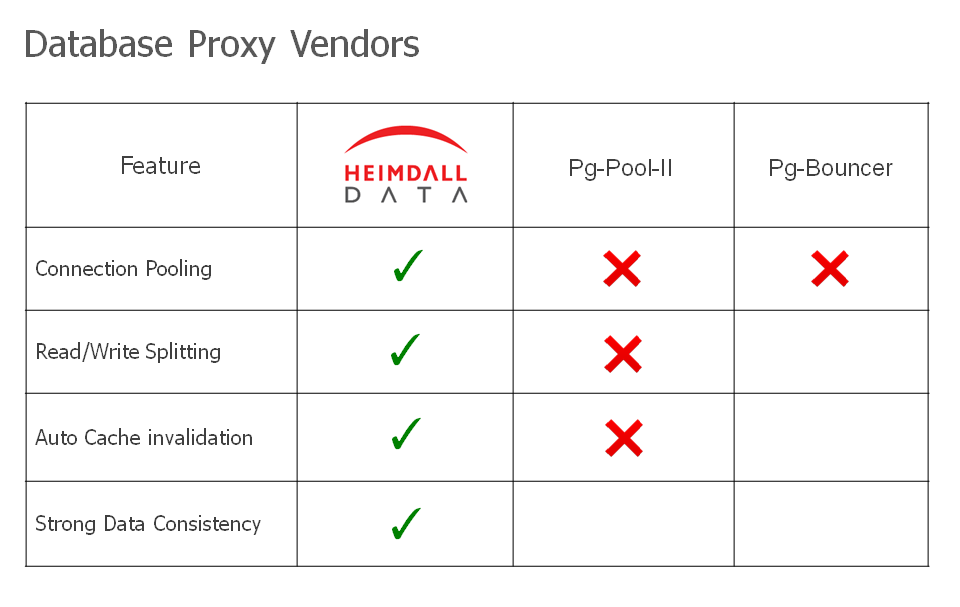
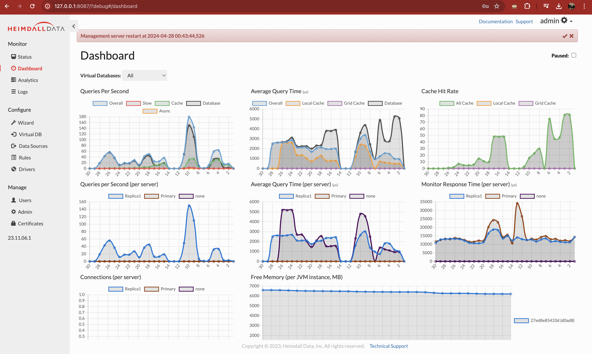
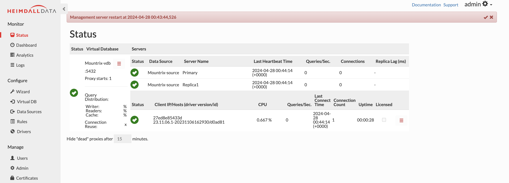
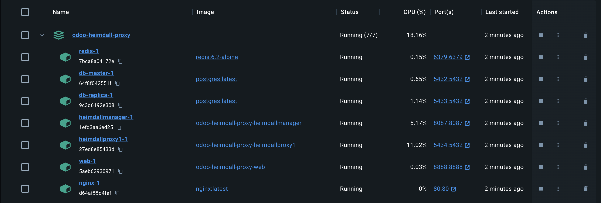

# Odoo Heimdall Proxy Development Environment

 
 
[Heimdall](https://www.heimdalldata.com/odoo/) is a database proxy specially designed for [Odoo](https://www.odoo.com)

## Heimdall Architecture with Odoo, Redis and Postgres





### Heimdall Manager Dashboard

- Cache hit rates
- Replica Usage
- Average Response Time



### Heimdall manager status overview



### docker desktop containers overview



### Project Architecture

    .
    ├── .vscode                     # Visual Studio Debug configuration
    ├── addons                      # Odoo Project custom addons folder
    ├── addons_customer             # Odoo Project customer addons
    ├── addons_external             # Odoo Project third party addons
    ├── config                      # Odoo config
    ├── heimdall                    # Heimdall
    ├── .gitignore
    ├── Dockerfile                  # Odoo Dockerfile
    ├── docker-compose.yml          # setup for local docker-compose run
    ├── requirements.txt            # Odoo external python libraries
    └── README.md

## Development workflow

- Local environment
- Ideal local development workflow

## Local environment

To setup your local environment you need the following tools:

- Docker installed in your machine
- IDE like Visual Studio code or PyCharm

#### Docker & docker-compose

Check the official docker page to install docker and docker-compose on your machine, it depends on your OS

#### Quick Instructions

```bash
 Docker-compose up
```

Access Heimdall Manager
http://127.0.0.1:8087

user: admin
password: admin

Go to Virtual DB and import Mountrix-vdb.json and commit

Stort docker-compose Ctrl+c and restart it

```bash
docker-compose up
```

Access Odoo
http://127.0.0.1/

user: admin
password: admin

Install any App and use Odoo. You'll see Heimdall proxy cache hit rates and replica use.
